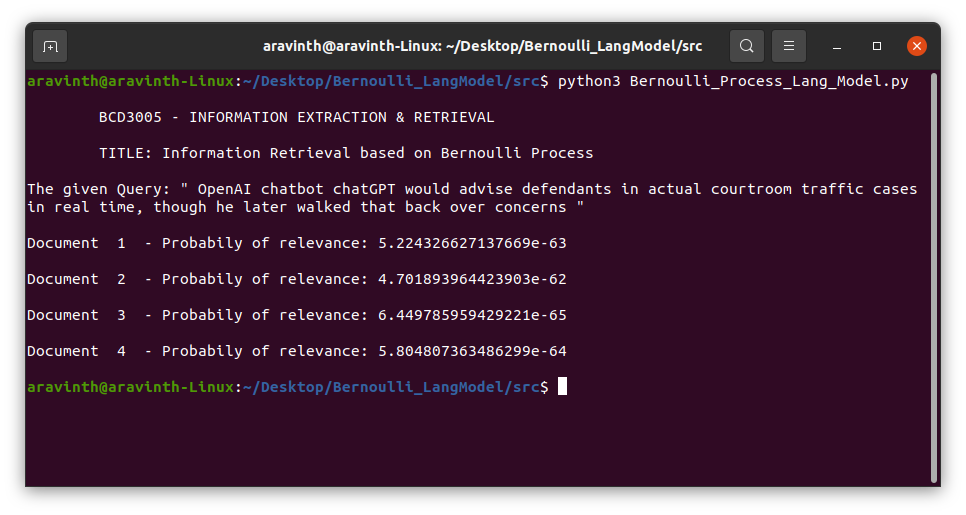

# Bernoulli_Process_based_Information_Retrieval_Model

"Bernoulli Process Information Retrieval" typically refers to a specific approach or model used in the context of information retrieval systems. In this context, the Bernoulli Process is employed to calculate the probability of relevance for documents in response to a user's query.

The Bernoulli Process Information Retrieval is a simplified and binary model for document ranking based on term presence or absence. It's a foundational concept in information retrieval, and while it has been used historically, more advanced models have been developed to capture the complexities of relevance ranking, including the use of term frequencies, inverse document frequencies, and more sophisticated statistical approaches.

Modern information retrieval systems often employ more complex models, such as the Vector Space Model, BM25, or machine learning-based methods, to improve the accuracy of ranking and retrieval, taking into account a wider range of factors beyond binary term presence. However, the Bernoulli Process can provide a basic understanding of how probabilistic models are applied in information retrieval.

## Here's a summary of what the code does:
- It imports the NumPy library for numerical operations.

- It defines four documents (doc1, doc2, doc3, and doc4) and a query (query) as strings. These documents seem to be related to OpenAI's ChatGPT and other AI language models.

- It creates a vocabulary by combining all the unique words from the documents and the query.

- It calculates the document frequencies (doc_freqs) for each word in the vocabulary by iterating through each document and counting how many times each word appears in the document.

- It calculates the probabilities of relevance (probs) for each document concerning the query by multiplying the document frequencies for words in the document and their absence probabilities in a Bernoulli Process.

- Finally, it prints the calculated probabilities of relevance for each document in response to the query, along with a title and the query itself.

The code essentially calculates the likelihood of each document being relevant to the given query using a probabilistic model. The document with the highest probability is considered the most relevant to the query.

The output of this code will show the probability of relevance for each of the four documents with respect to the query. The higher the probability, the more relevant the document is considered to be.

## Here's how the output looks like

